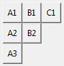
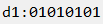

# Widget Categories

There are three categories of widgets:

 - groups of widgets that are useful as a group
 - visual aids using the canvas
 - useful improvements on existing widgets

# Tkinter Setup

Each of the below code examples assumes a structure similar to the below
in order to setup the root environment.

```python
import tkinter as tk
import tk_tools

root = tk.Tk()

# -----------------------------------
# ----- your GUI widget(s) here -----
# -----------------------------------

root.mainloop()
```

# Widgets

## LabelGrid

The `LabelGrid` is intended to display tabular data easily and
effectively.  The `LabelGrid` is a collection of `tkinter.Label` objects
arranged into a grid for easy access.


```python
LabelGrid(
    parent,                 # parent widget (root or frame)
    num_of_columns: int,    # number of columns
    headers: list=None,     # list of headers, each element should be a string
    **options               # frame options for tkinter.Frame element
)
```

Methods:

 - `.add_row(data: list)` - add a row of data
 - `.remove_row(row_number: int=-1)` - remove the specified row of data,
 removes the last row by default
 - `.clear()` - removes all rows of data

The above widget was creating with the following code snippet:

```python
label_grid = tk_tools.LabelGrid(root, 3, ['Column0', 'Column1', 'Column2'])
label_grid.grid(row=0, column=0)

for _ in range(5):
    label_grid.add_row([1, 2, 3])
```

## EntryGrid

The `EntryGrid` is intended to allow the user to enter tabular data
easily and effectively.  The `EntryGrid` is a collection of
`tkinter.Entry` objects arranged into a grid for easy access.  The
creation of the `EntryGrid` widget is virtually identical to the
creation of the `LabelGrid` widget, but access to user-entered data
makes this widget most useful.


```python
EntryGrid(
    parent,                 # parent widget (root or frame)
    num_of_columns: int,    # number of columns
    headers: list=None,     # list of headers, each element should be a string
    **options               # frame options for tkinter.Frame element
)
```

Methods:

 - `.add_row(data: list=None)` - add a row of data with the option of
 pre-populating the entries with a list of strings
 - `.remove_row(row_number: int=-1)` - remove the specified row of data,
 removes the last row by default
 - `.clear()` - removes all rows of data
 - `.read(as_dicts=True)` - read the data as a dictionary (default)or
 as a list of lists (rows)

The above widget was creating with the following code snippet:

```python
entry_grid = tk_tools.EntryGrid(root, 3, ['L0', 'L1', 'L2'])
entry_grid.grid(row=0, column=0)

for _ in range(5):
    entry_grid.add_row()
```

## ButtonGrid
The `ButtonGrid` is intended for easy creation of multiple `tkinter.Button`
elements at once.



```python
ButtonGrid(
    parent,                 # parent widget (root or frame)
    num_of_columns: int,    # number of columns
    headers: list=None,     # list of headers, each element should be a string
    **options               # frame options for tkinter.Frame element
)
```

Methods:

 - `.add_row(data: list=None)` - add a row of buttons
 - `.remove_row(row_number: int=-1)` - remove the specified row of buttons
 - `.clear()` - removes all rows of button


The above widget was creating with the following code snippet:

```python
button_grid = tk_tools.ButtonGrid(root, 3, None)
button_grid.grid()

func1  = lambda: print('Row 1')
func2  = lambda: print('Row 2')
func3  = lambda: print('Row 3')

button_grid.add_row([("A1", func1), ("B1", func1), ("C1", func1)])
button_grid.add_row([("A2", func2), ("B2", func2)])
button_grid.add_row([("A3", func3)])
```

## Key/Value Entry

The `KeyValueEntry` widget is a really useful way to get data from the
user or to present data to the user.  So many times, you will end up
coding up a label, then an entry.  This widget combines those with the
ability to enable or disable the entries so that it may be used for
data presentation.  Data is retrieved as a dictionary for the most
natural programmatic access.

Below are shown three different instances of the `KeyValueEntry` widget
in different configurations to show the dynamism of this widget.


```python
KeyValueEntry(
    parent,                     # parent widget (root or frame)
    keys: list,                 # the labels of the entries (later used for access)
    defaults: list=None,        # supply default values
    unit_labels: list=None,     # list of unit strings (useful if you have units)
    enables: list=None,         # list of True/False values (default all True)
    title=None,                 # title for the section
    on_change_callback=None,    # callback function when a value changes
    **options                   # frame options for tkinter.Frame element
)
```

Methods:

 - `.reset()` - clears all entries
 - `.change_enables(enables_list: list)` - change the enables using a list
 - `.load(data: dict)` - load data into the widget by dictionary using
 the keys supplied during the widget creation
 - `.get()` - returns the entries as a dict using the keys supplied
 during widget creation

The above widget was creating with the following code snippet:

```python
# create the key-value with a title
kve0 = tk_tools.KeyValueEntry(
    root,
    title='Key/Value 0',
    keys=['Buckets', 'Dollars', 'Hens'],
    unit_labels=['buckets', 'dollars', 'hens'],
)
kve0.grid(row=0)

# create another key-value set without a title and with no units
kve1 = tk_tools.KeyValueEntry(
    root,
    keys=['Baskets', 'Cows']
)
kve1.grid(row=1)

# create a key-value with some entries disabled, then load values into each
kve2 = tk_tools.KeyValueEntry(
    root,
    title='Static Key Value',
    keys=['Buckets', 'Dollars', 'Hens'],
    unit_labels=['buckets', 'dollars', 'hens'],
    enables=[False, False, True]
)
kve2.grid(row=2)
kve2.load({'Buckets': 'x', 'Dollars': 'y', 'Hens': 'z'})
```

## Graph

Plotting is typically done using matplotlib, and rightly so.  Unfortunately,
matplotlib can be difficult to install for novices on some machines.  This
provides a relatively easy substitute that will work for some simple
situations.


```python
Graph(
    parent,     # parent widget (root or frame)
    x_min,      # x minimum
    x_max,      # x maximum
    y_min,      # y minimum
    y_max,      # y maximum
    x_scale,    # the 'tick' on the x-scale
    y_scale,    # the 'tick' on the y-scale
    **options   # frame options for tkinter.Frame element
)
```

Methods:

 - `.plot_point(x, y, visible=True, color='black', size=5)` - plot a
 single point
 - `.plot_line(points: list, color='black', point_visibility=False)` - plot
 a line with a list of (x, y) tuples

The above widget was creating with the following code snippet:

```python
# create the graph
graph = tk_tools.Graph(
    parent=root,
    x_min=-1.0,
    x_max=1.0,
    y_min=0.0,
    y_max=2.0,
    x_scale=0.5,
    y_scale=0.5,
    width=500,
    height=400
)

graph.grid(row=0, column=0)

# create an initial line
line_0 = [(x/10, x/10) for x in range(10)]
graph.plot_line(line_0)

# plot the line with points
line_1 = [(x/5 - 1.0, x/10.0) for x in range(10)]
graph.plot_line(line_1, point_visibility=True, color='blue')

# plot a single point
point = (0.5, 0.75)
graph.plot_point(*point, color='red')
```

## RotaryScale

The `RotaryScale` looks much like a speedometer. It is used when a
quick graphical indicator is needed. It could probably use some
look-and-feel improvements, but will do the job in most cases.  Shows
both the visual and the textual value, with units if the unit is
supplied.


```python
RotaryScale(
    parent,             # parent widget (root or frame)
    max_value=100.0,    # the value that corresponds to 100%
    size=100,           # size in pixels of the graphical portion
    unit='',            # unit to display
    **options           # frame options for tkinter.Frame element
)
```

Methods:

 - `.set_value(number: float)` - set the value to display

The above widget was creating with the following code snippet:

```python
p = tk_tools.RotaryScale(root, max_value=100.0, size=100, unit='km/h')
p.grid(row=0, column=0)

p.set_value(65.0)
```

## LED

The `Led` is an indicator that is used to quickly display binary values.
The colors available are red, yellow, green, and grey.  Except for grey, 
each color has an `on` or `off` state that can be utilized to flash an LED.

This is a class that you might use for a traffic light program.


Methods: 

 - `def to_grey()` - grey LED (default)
 - `def to_green(on=False)` - green LED, on or off
 - `def to_red(on=False)` - red LED, on or off
 - `def to_yellow(on=False)` - yellow LED, on or off

```python
led = tk_tools.Led(root, size=50)
led.grid(row=0, column=0)

led.to_red(False)  # initialize to off
led.to_red(True)   # turn LED on
```

## SmartOptionMenu

The `SmartOptionMenu` is an exact copy of the `tkinter.OptionMenu` widget
in which the user doesn't have to create a variable to track.  Additionally,
callbacks can be added that will be called when the user makes a selection.

```python
SmartOptionMenu(
    parent,                     # parent widget (root or frame)
    options: list,              # a list of the options to give to the user
    initial_value: str=None,    # set a default initial value
    callback: callable=None     # a callback function when changed
)
```

Methods:

 - `.add_callback(callback: callable)` - a function to be called when
 the user makes a selection
 - `.get()` - returns a string representing the user selection
 - `.set(value: str)` - sets the value of the widget

Example:

```python
som = tk_tools.SmartOptionMenu(root, ['one', 'two', 'three'])
som.grid()


def callback():
    print(som.get())

som.add_callback(callback)
```

## SmartSpinBox

Much like the `SmartOptionMenu`, the `SmartSpinBox` is a copy of its
base widget `tkinter.SpinBox`.  Again, the user simply doesn't need
to create a variable to trace, simplifying overall code structure.

```python
SmartSpinBox(
    parent,                     # parent widget (root or frame)
    entry_type: str='float',    # 'str', 'int', or 'float'
    callback: callable=None,    # a callback function
    **options                   # options valid for tkinter.SpinBox
)
```

Methods:

 - `.add_callback(callback: callable)` - a callback function to be called
 when the spinbox variable changes
 - `.set(value)` - set the value
 - `.get()` - returns the value

Example:

```python
ssb = tk_tools.SmartSpinBox(root, 'float', from_=0, to=5, increment=0.1, callback=lambda: print('it works'))
ssb.grid()

print(ssb)

def callback():
    print(ssb.get())

ssb.add_callback(callback)
```

## SmartCheckbutton

The `SmartCheckbutton` is a subclass of `tkinter.Checkbutton` that simply
wraps the variable into the object and adding a callback function.  The
variable is always a `bool` type.

```python 
SmartCheckbutton(
    parent,                     # parent widget (root or frame)
    callback: callable=None,    # a callback function
    **options                   # tkinter.Checkbutton options
)
```

Methods:

 - `.add_callback(callback: callable)` - a callback function to be called
 when the spinbox variable changes
 - `.set(value)` - set the value
 - `.get()` - returns the value

Example:

```python 
# create the smart spinbox and grid
scb = tk_tools.SmartCheckbutton(root)
scb.grid()

# define a callback function that retrieves the currently selected option
def callback():
    print(scb.get())

# add the callback function to the checkbutton
scb.add_callback(callback)
```

## ByteLabel
The `ByteLabel` is a subclass of `tkinter.Label` that holds one byte and
automatically updates the representing text. It provies a variety of methods
for easy bit manipulation.



```python
ByteLabel(
    parent,             # parent widget (root or frame)
    value=0,            # the inital value
    prefix="",          # a prefix string to identify when using mutiple labels
    **options           # label options for tkinter.Label element
)
```

Methods:

 - `.get()` - returns the int value
 - `.set(value)` - sets the int value (only 0 to 255 allowed)
 - `text_update` - updates the text, no need to call externally
 - `.get_bit(position)` - returns bit at position (only 0 to 7 allowed)
 - `.toggle_bit(position)` - toggles bit at position (only 0 to 7 allowed)
 - `.set_bit(position)` - sets bit to 1 at position (only 0 to 7 allowed)
 - `.clear_bit(position)` - sets bit to 0 at position (only 0 to 7 allowed)
 - `.get_msb()` - returns most significant bit
 - `.toggle_msb()` - toggles most significant bit
 - `.set_msb()` - sets most significant bit to 1
 - `.clear_msb()` - sets most significant bit to 0
 - `.get_lsb()` - returns least significant bit
 - `.toggle_lsb()` - toggles least significant bit
 - `.set_lsb()` - sets least significant bit to 1
 - `.clear_lsb()` - sets least significant bit to 0
 
 The above widget was creating with the following code snippet:

```python 
# create the byte label wit all bits set to 1
b1 = tk_tools.ByteLabel(root, 0xFF, "d1:", font="Consolas 12")
b1.grid()

# Clear all odd bits
for i in range(1, 8, 2):
    blabel1.clear_bit(i)
```
