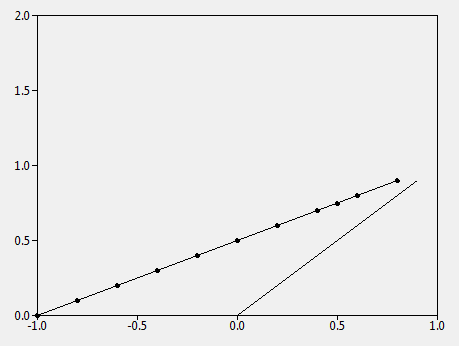
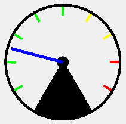
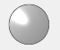

# Purpose

This repository is intended to hold some of the most useful, higher-level widgets
that are native to tkinter.  This library is currently compatible with Python 3.5+ (uses
type hints), but could easily be back-ported to earlier versions if desired.

For more details, check out the [documentation](https://tk-tools.readthedocs.io).

# Samples








# Installation

## Direct Installation

Clone this repository, and navigate to the root directory of the install and run
the setup.py installer:

```bash
$> git clone https://github.com/slightlynybbled/tk_tools
$> cd tk_tools
$> python setup.py install
```

## Pip

You can also `pip install tk_tools`.

# Contributions

Please request additional widgets in the
[issues](https://github.com/slightlynybbled/tk_tools/issues).

# Using the Widgets

All widgets are implemented as subclasses of frames and are - as a result - easily used
just as any other widget in tkinter would be utilized.  These must be placed in a frame
or toplevel using `grid()` or `pack()` just like any other frame.

# Examples

Examples of these widgets may be found within the [examples](./examples/) directory.

# Widgets

Most of the widgets added here fall into three rough classes:

 - groups of sub-widgets (i.e. grids)
 - visual aids using the canvas (i.e. graph, rotary scale)
 - improvements on existing widgets (i.e. dropdown)
 
Omitted in each are the tkinter setup and run code.  As such, it is assumed that all of
the below will have the proper import and a tkinter object called `root` on which to
populate:

```python 
import tkinter as tk
import tk_tools

root = tk.Tk()

# -----------------------------------
# ----- your GUI widget(s) here -----
# -----------------------------------

root.mainloop()
```

## Label Grid

The `LabelGrid` is intended to display tabular data easily and effectively.


```python 
label_grid = tk_tools.LabelGrid(root, 3, ['Column0', 'Column1', 'Column2'])
label_grid.grid(row=0, column=0)

for _ in range(5):
    label_grid.add_row([1, 2, 3])
```

## Entry Grid

The `EntryGrid` is a spreadsheet-like grid of entry widgets intended to allow easy entry
of data.  When the cursor is in the bottom right entry, pressing `<Tab>` on your keyboard
will add a new row.


```python 
entry_grid = tk_tools.EntryGrid(root, 3, ['L0', 'L1', 'L2'])
entry_grid.grid(row=0, column=0)

for _ in range(5):
    entry_grid.add_row()
```

## Key/Value

So often, it is necessary to simply extract a key/value from the user.  This widget allows
a quick creation of multiple key/value entries and supplies a `get()` method for easily
retrieving those values as a dictionary.  This can also be used as a display widget and may
have or not have titles.

Here, we are shown three key/value entries in various conditions.


```python 
# create the key-value with a title
kve0 = tk_tools.KeyValueEntry(
    root,
    title='Key/Value 0',
    keys=['Buckets', 'Dollars', 'Hens'],
    unit_labels=['buckets', 'dollars', 'hens'],
)
kve0.grid(row=0)

# create another key-value set without a title and with no units
kve1 = tk_tools.KeyValueEntry(
    root,
    keys=['Baskets', 'Cows']
)
kve1.grid(row=1)

# create a key-value with some entries disabled, then load values into each
kve2 = tk_tools.KeyValueEntry(
    root,
    title='Static Key Value',
    keys=['Buckets', 'Dollars', 'Hens'],
    unit_labels=['buckets', 'dollars', 'hens'],
    enables=[False, False, True]
)
kve2.grid(row=2)
kve2.load({'Buckets': 'x', 'Dollars': 'y', 'Hens': 'z'})
```

## Graph

Usually, plotting is done using `matplotlib`.  Unfortunately, this is a pretty serious
installation commitment for some.  Here is an alternative simple graphing widget that
may be utilized for some plotting situations.


Note that we can plot individual points, plot lines, and plot lines with points.

```python 
# create the graph
graph = tk_tools.Graph(
    parent=root,
    x_min=-1.0,
    x_max=1.0,
    y_min=0.0,
    y_max=2.0,
    x_scale=0.5,
    y_scale=0.5,
    width=500,
    height=400
)

graph.grid(row=0, column=0)

# create an initial line
line_0 = [(x/10, x/10) for x in range(10)]
graph.plot_line(line_0)

# plot the line with points
line_1 = [(x/5 - 1.0, x/10.0) for x in range(10)]
graph.plot_line(line_1, point_visibility=True, color='blue')

# plot a single point
point = (0.5, 0.75)
graph.plot_point(*point, color='red')
```

## Rotary Scale

The `RotaryScale` looks much like a speedometer.  It is used when a quick graphical
indicator is needed.  It could probably use some look-and-feel improvements, but
will do the job.


```python 
p = tk_tools.RotaryScale(root, max_value=100.0, size=100, unit='km/h')
p.grid(row=0, column=0)

p.set_value(65.0)
```

## SmartOptionMenu/Drop Down

The `DropDown` is an improvement on the `OptionMenu` in which you don't have to
create a `StringVar`.  It is simply managed as part of the class and is provided for
easy creation of drop down menus.


```python 
som = tk_tools.SmartOptionMenu(root, ['one', 'two', 'three'])
som.grid()


def callback():
    print(som.get())

som.add_callback(callback)
```

## SmartSpinBox

The `SmartSpinBox` is an improvement on the `SpinBox` already available in tkinter.
You simply don't have to create any variables to manage as they are included as part
of the package.  The below code illustrates the creation and addition of TWO functions
to the `SmartSpinBox`.  Functions may be added at initialization or later, as desired.
I'm not including a graphic as it looks like any other `SpinBox`.

```python 
ssb = SmartSpinBox(root, 'float', from_=0, to=5, increment=0.1, callback=lambda: print('it works'))
ssb.grid()

print(ssb)

def callback():
    print(ssb.get())

ssb.add_callback(callback)
```

# Log

## v0.2.0

 * Added SmartSpinBox
 * Changed `DropDown` to `SmartOptionMenu`
